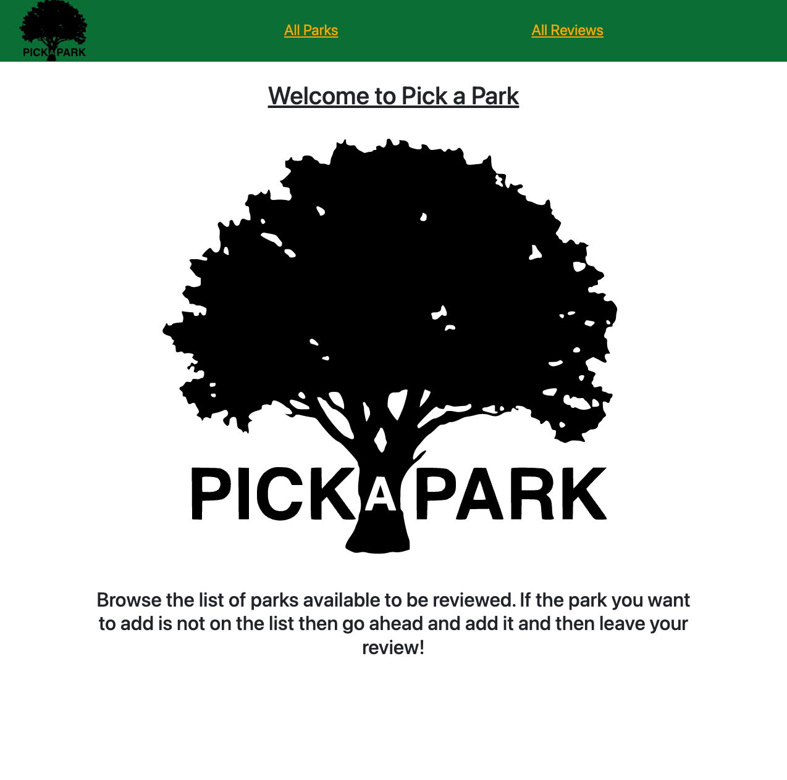

 

<h1 align="center">Pick-a-Park</h1>

### Description

Pick a park is an application that was designed to allow parents to review and rate parks in their area for other parents to see!

### Screenshot

### Technologies Used:

- NODE.js
- Express
- MongoDB
- JavaScript
- EJS
- CSS
