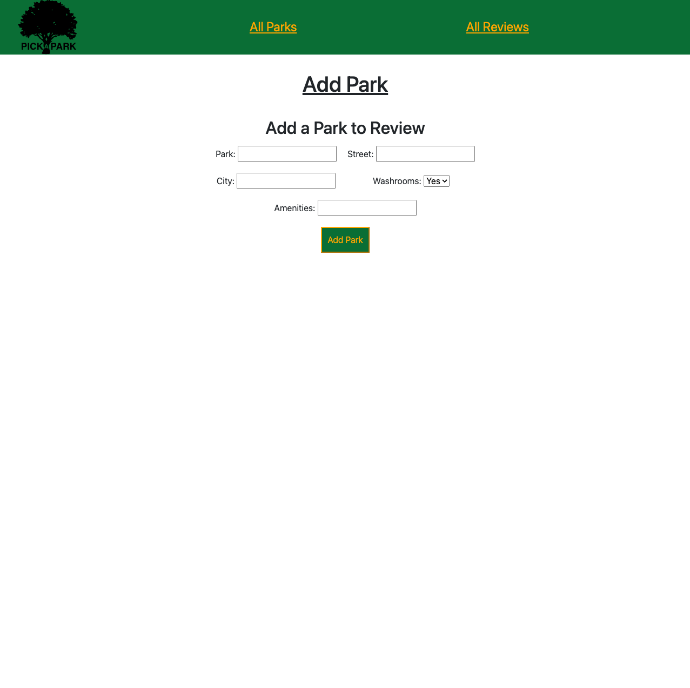
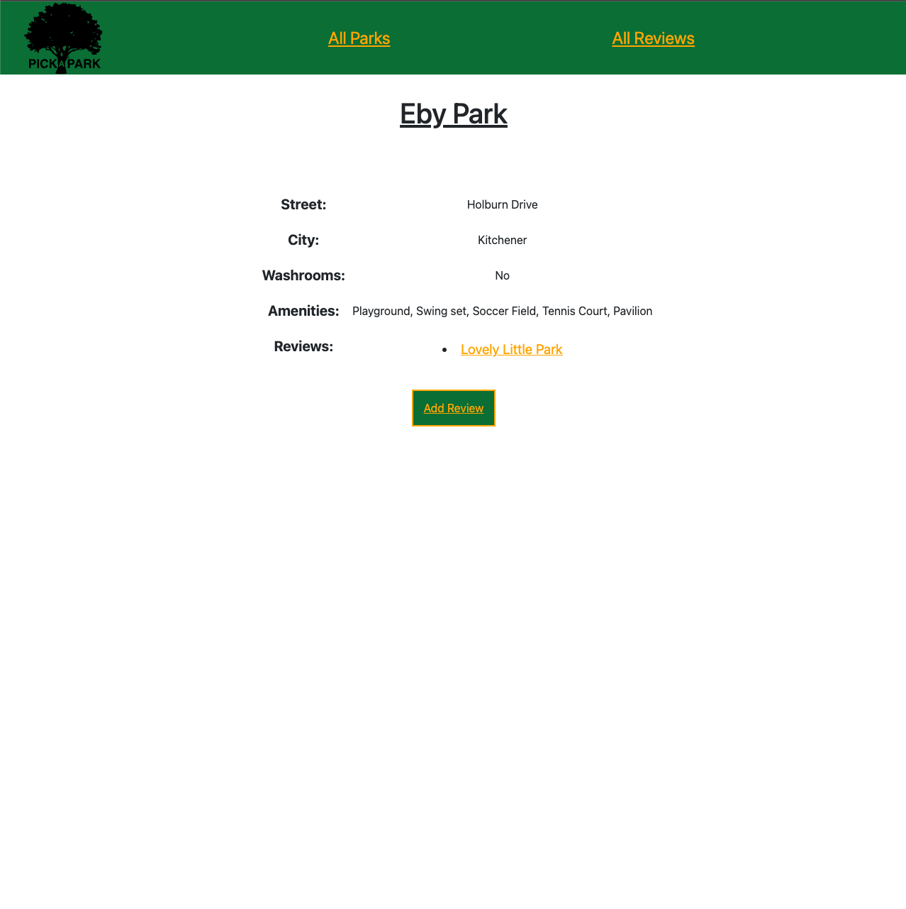
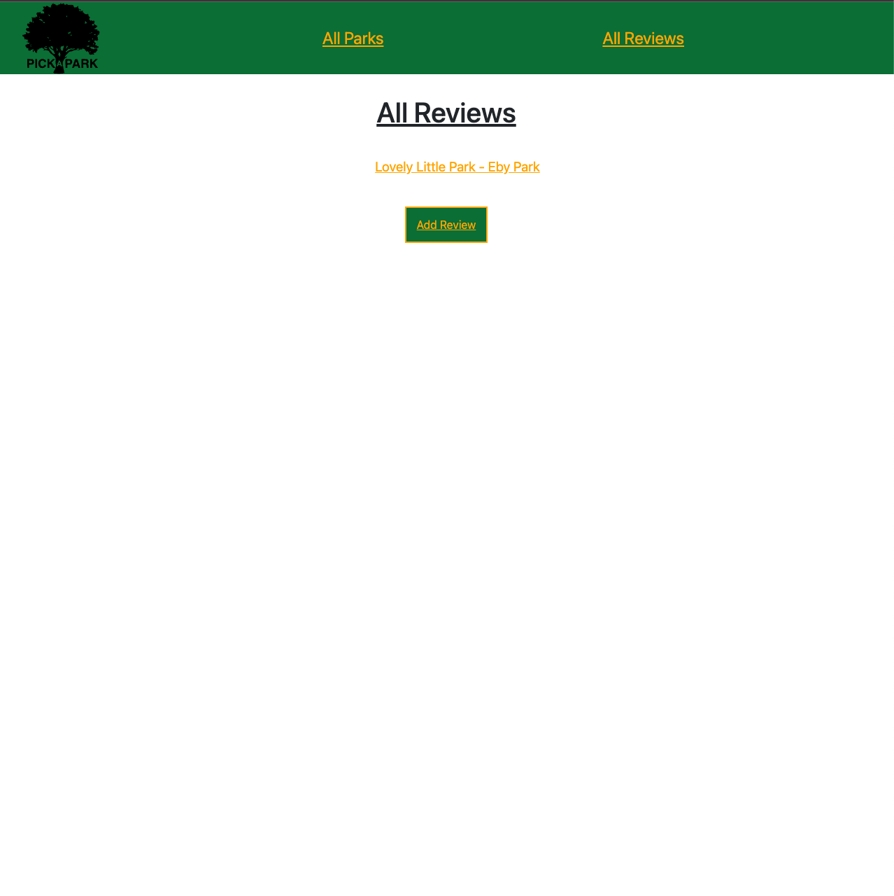
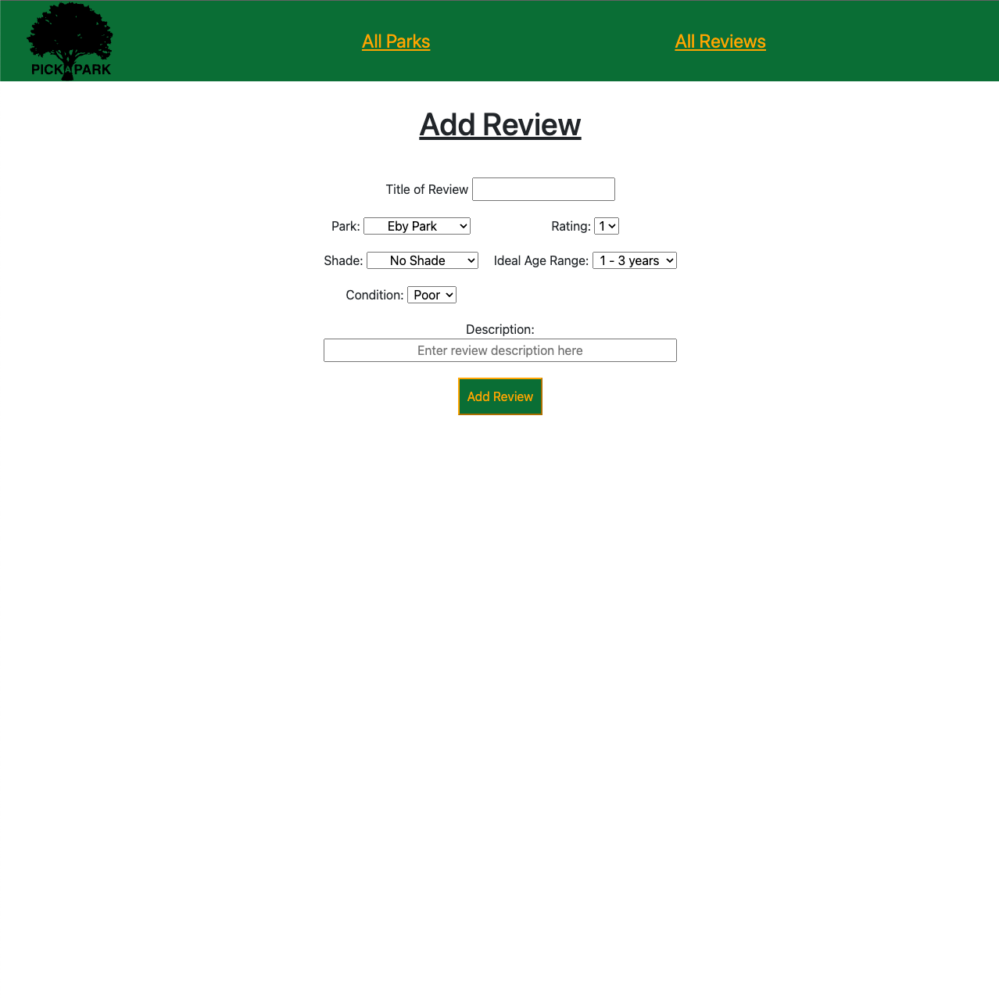
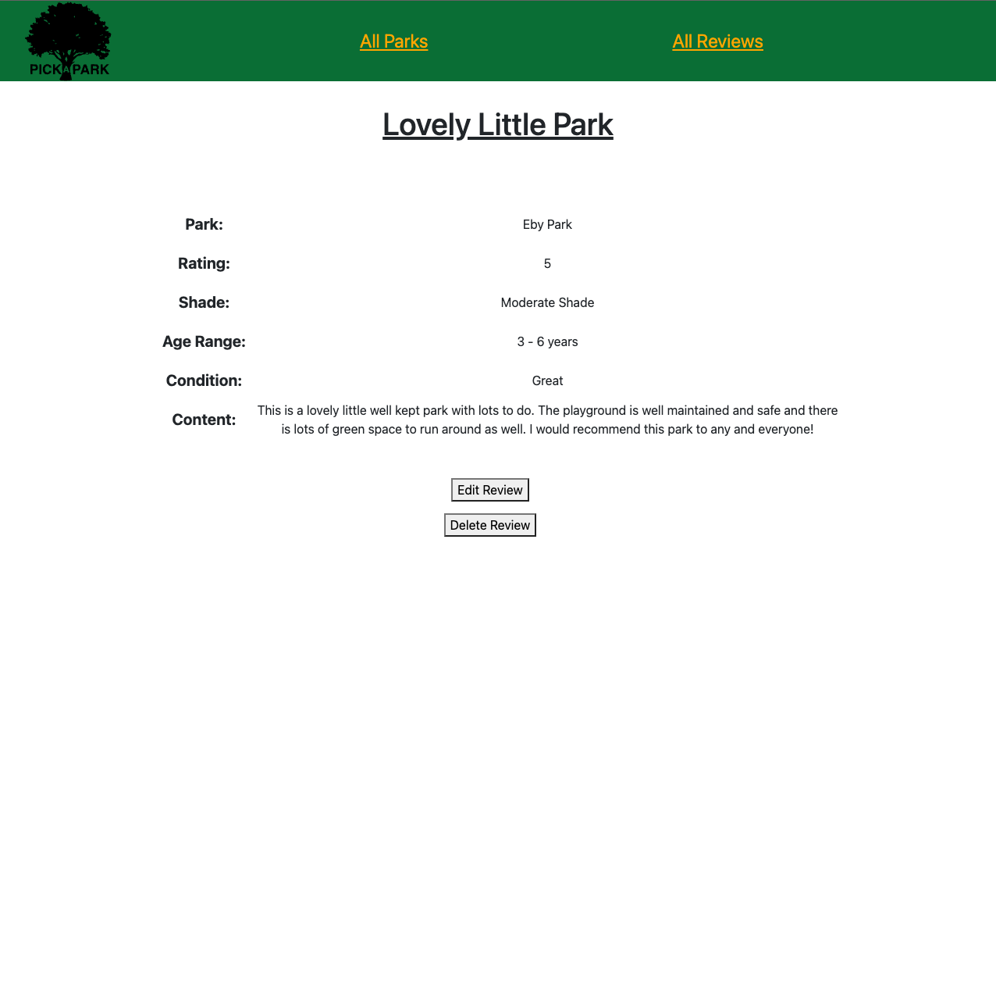

 

<h1 align="center">Pick-a-Park</h1>

### Description

Pick a park is an application that was designed to allow parents to review and rate parks in their area for other parents to see!

### Screenshots

#### Home Page

#### Park Index

#### New Park

#### Show Park

#### Review Index

#### New Review

#### Show Review

### Technologies Used:

- NODE.js
- Express
- MongoDB
- JavaScript
- EJS
- CSS

### Next Steps

- Integrate OAuth with working application
- Add ability to comment on reviews
- Show user avatar/name on that users reviews/comments
- Utilize a geolocation API to view parks in your area
- Find a way to link images for each park
- Implement show functionality for users so you can see some info on who is posting the review and other reviews they have made.
